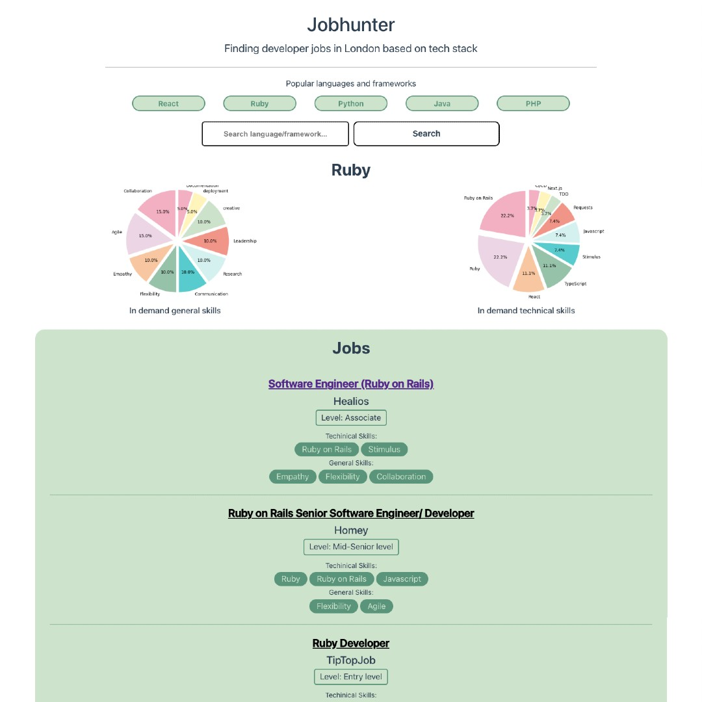

# Jobhunter

### Technologies used

- Vue.js

The aim of this project is to search for available jobs in London based on your chosen programing language/framework. It includes a pie chart of the most popular skills needed from all of the roles, to give you an idea of what skills would be useful to learn or of upcoming trends.

I was able to collect this data by webscraping using Beautiful Soup and Django. Please have a look at my [backend repo](https://github.com/Pea75x/job-and-event-project) for details 



<!-- ### Run Unit Tests with [Vitest](https://vitest.dev/)

```sh
npm run test:unit
```

### Run End-to-End Tests with [Playwright](https://playwright.dev)
```sh
# Install browsers for the first run
npx playwright install

# When testing on CI, must build the project first
npm run build

# Runs the end-to-end tests
npm run test:e2e
# Runs the tests only on Chromium
npm run test:e2e -- --project=chromium
# Runs the tests of a specific file
npm run test:e2e -- tests/example.spec.ts
# Runs the tests in debug mode
npm run test:e2e -- --debug
``` -->
